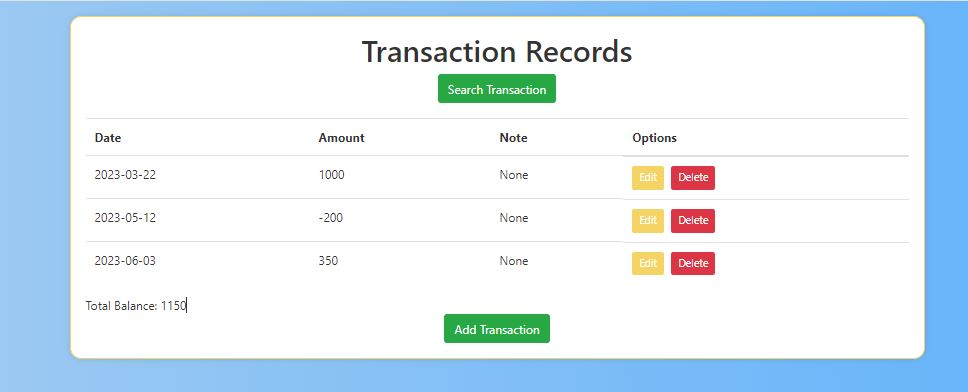

# Transactions Records Flask App

This Flask app allows users to manage transaction records. Users can add, edit, delete, and search transactions. Additionally, users can filter transactions by minimum and maximum amounts.

## Features

- **Add Transactions**: Add a new transaction with date, amount, and note.
- **Edit Transactions**: Edit existing transactions.
- **Delete Transactions**: Remove transactions from the record.
- **Search Transactions**: Filter transactions by specifying minimum and maximum amounts.
- **View Total Balance**: Display the total balance of all transactions.

